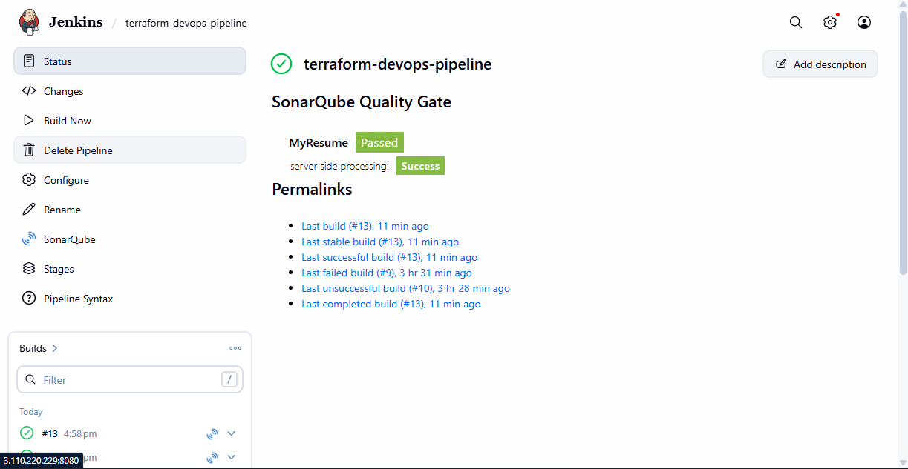
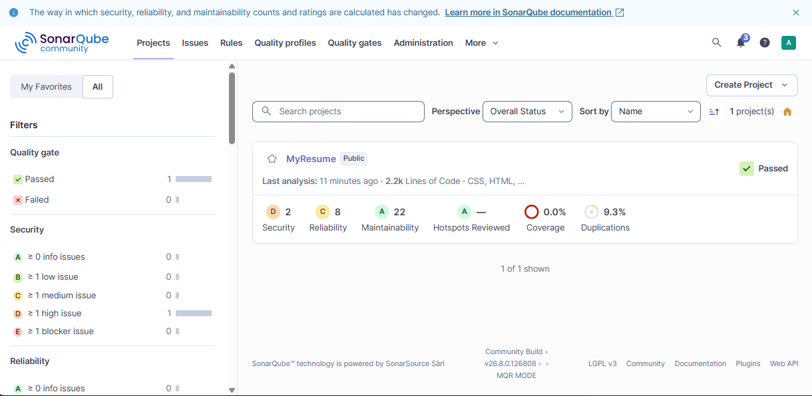
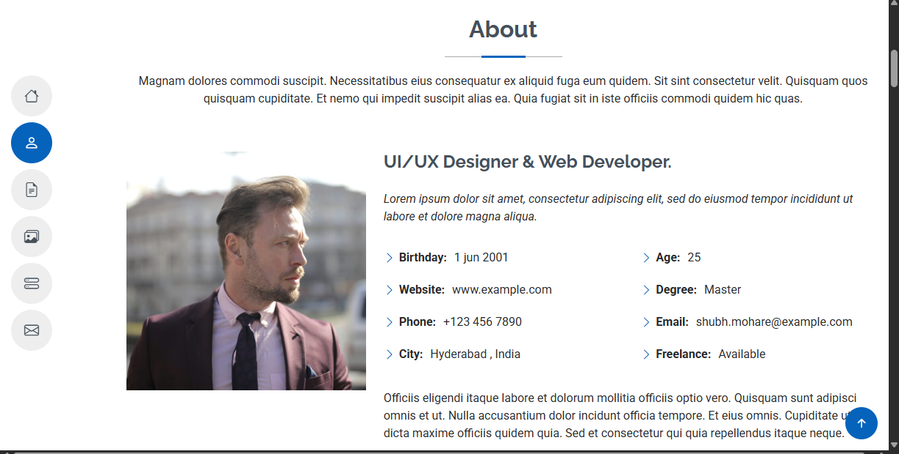

# 🚀 MyResume — AWS DevOps CI/CD Project

  <b>AWS • DevOps • CI/CD • Docker • Jenkins • Terraform • SonarQube</b>

  A personal resume website deployed using a complete DevOps workflow on AWS.

---

## 📌 Project Overview

**MyResume** is a personal resume website that I containerized using Docker and deployed on AWS EC2.

This project demonstrates a practical DevOps workflow using **GitHub, Jenkins, SonarQube, Docker, Docker Hub, Terraform, Linux and AWS EC2**.

The goal of this project was to build a repeatable CI/CD process where source-code changes can be analyzed, tested, containerized and deployed.

---

## 🏗️ Architecture

<pre>
                         ┌──────────────┐
                         │    GitHub    │
                         │ Source Code  │
                         └──────┬───────┘
                                │
                                ▼
                         ┌──────────────┐
                         │    Jenkins   │
                         │    CI/CD     │
                         └──────┬───────┘
                                │
                 ┌──────────────┴──────────────┐
                 ▼                             ▼
          ┌──────────────┐              ┌──────────────┐
          │  SonarQube   │              │    Docker    │
          │ Code Quality │              │    Build     │
          └──────────────┘              └──────┬───────┘
                                               │
                                               ▼
                                        ┌──────────────┐
                                        │  Docker Hub  │
                                        │   Registry   │
                                        └──────┬───────┘
                                               │
                                               ▼
                                        ┌──────────────┐
                                        │   AWS EC2    │
                                        │ Application  │
                                        │    Server    │
                                        └──────┬───────┘
                                               │
                                               ▼
                                        🌐 MyResume App
</pre>

---

## 🔄 CI/CD Workflow

**GitHub → Jenkins → SonarQube → Docker Build → Docker Test → Docker Hub → AWS EC2 → MyResume**

---

## 🛠️ Technologies Used

| Technology | Purpose |
|------------|---------|
| ☁️ AWS EC2 | Cloud infrastructure |
| 🏗️ Terraform | Infrastructure as Code |
| 🔧 Jenkins | CI/CD automation |
| 🔍 SonarQube | Code quality analysis |
| 🐳 Docker | Application containerization |
| 📦 Docker Hub | Container image registry |
| 🐙 GitHub | Source code management |
| 🌿 Git | Version control |
| 🐧 Linux | Server administration |
| 🌐 Nginx | Web server |
| 💻 HTML | Application |
| 🎨 CSS | Styling |
| ⚡ JavaScript | Frontend functionality |

---

## ☁️ AWS Infrastructure

The project uses separate AWS EC2 servers for:

- **Jenkins Server** — CI/CD automation
- **SonarQube Server** — Code quality analysis
- **Application Server** — Runs the Dockerized MyResume application

Infrastructure was managed using **Terraform**.

---

## ⚙️ Jenkins CI/CD Pipeline

The Jenkins pipeline is defined using a `Jenkinsfile`.

### Pipeline Stages

1. **Checkout** — Pull source code from GitHub
2. **SonarQube Analysis** — Analyze source code
3. **Docker Build** — Build the application image
4. **Docker Test** — Run and test the container
5. **Docker Hub Push** — Publish the Docker image

---

## 🔍 SonarQube

SonarQube is integrated with Jenkins for automated code-quality analysis.

The MyResume project successfully passed the **SonarQube Quality Gate**.

**Result: ✅ PASSED**

---

## 🐳 Docker

The application is containerized using Docker and served using Nginx.

**Build Docker Image**

`docker build -t myresume:latest .`

**Run Container**

`docker run -d --name myresume -p 80:80 myresume:latest`

**Check Container**

`docker ps`

---

## 📦 Docker Hub

The Docker image is published to Docker Hub:

**shubhmohare/myresume:latest**

The Application EC2 server pulls the image and runs the MyResume application inside a Docker container.

---

## 📸 Project Screenshots

### 🔧 Jenkins CI/CD Pipeline

### 🔍 SonarQube Quality Gate

### 🌐 Deployed MyResume Website

---

## 📁 Project Structure

<pre>
MyResume-Project/
│
├── assets/
├── forms/
│
├── screenshot/
│   ├── jenkins-pipeline.png
│   ├── sonarqube.png
│   ├── website-1.png
│   └── website-2.png
│
├── index.html
├── portfolio-details.html
├── service-details.html
├── starter-page.html
│
├── Dockerfile
├── Jenkinsfile
└── README.md
</pre>

---

## 🚀 Deployment Process

### 1️⃣ Code Update

Code is maintained in GitHub.

### 2️⃣ Jenkins

Jenkins automatically pulls the latest source code and starts the CI/CD pipeline.

### 3️⃣ SonarQube

The source code is analyzed for code-quality issues.

### 4️⃣ Docker

Jenkins builds the Docker image and performs a container test.

### 5️⃣ Docker Hub

The tested Docker image is published to Docker Hub.

### 6️⃣ AWS EC2

The Application Server pulls the latest Docker image and runs the MyResume website.

---

## 🎯 Key DevOps Concepts Demonstrated

- Infrastructure as Code with Terraform
- CI/CD with Jenkins
- Static code analysis with SonarQube
- Docker containerization
- Docker image management
- Git and GitHub workflow
- Linux server administration
- AWS EC2 deployment
- Jenkins Pipeline as Code
- Automated Docker testing
- Container registry management

---

## 💡 What I Learned

This project gave me practical hands-on experience with:

- AWS EC2
- Terraform
- Jenkins
- SonarQube
- Docker
- Docker Hub
- Git & GitHub
- Linux
- CI/CD
- Cloud deployment

---

## 👨‍💻 Author

### Shubham Mohare

**Aspiring AWS & DevOps Engineer**

`AWS` • `DevOps` • `Terraform` • `Docker` • `Kubernetes` • `Jenkins` • `Linux`

---

⭐ Thanks for checking out my project!
